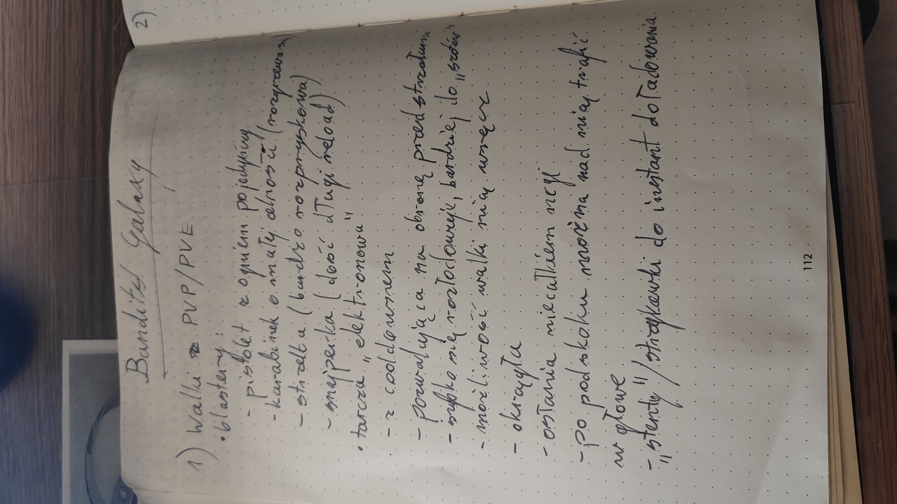
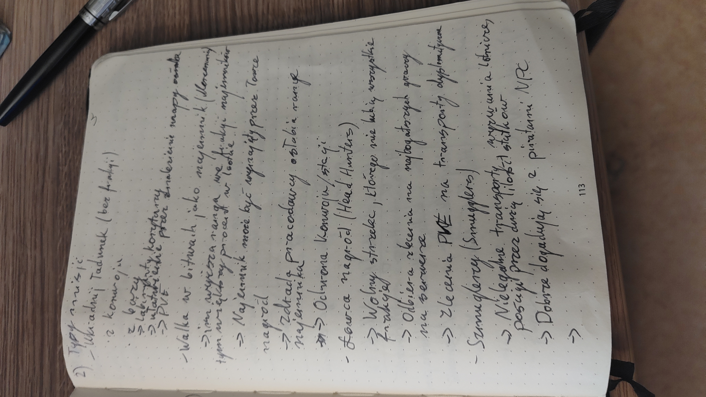
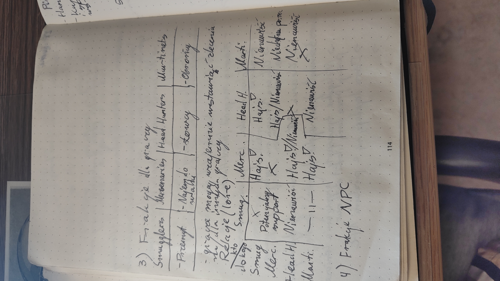
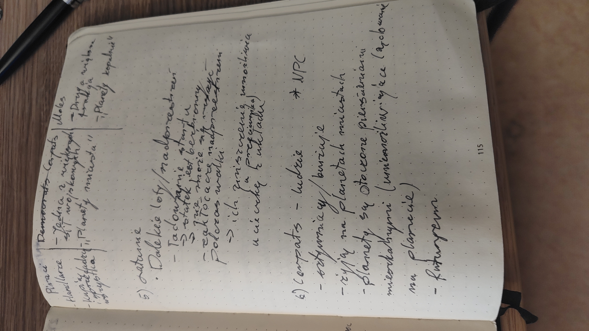
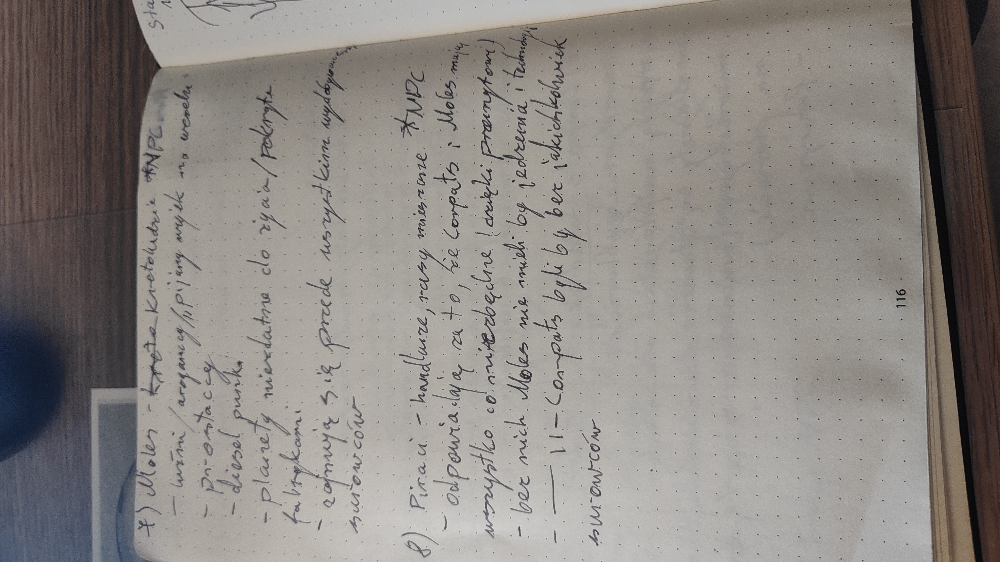
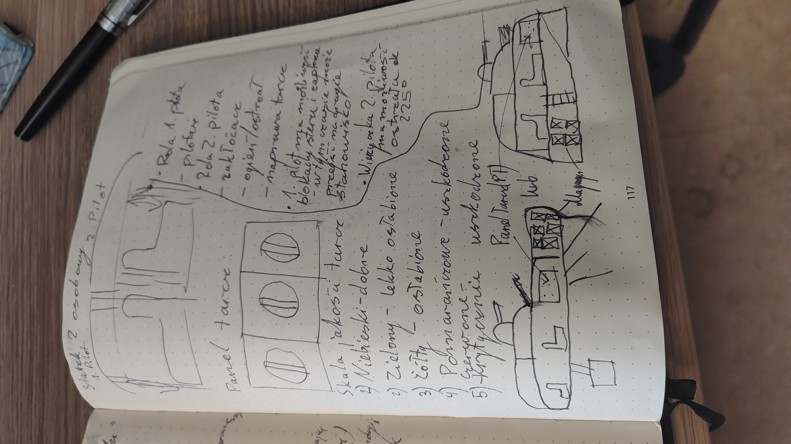
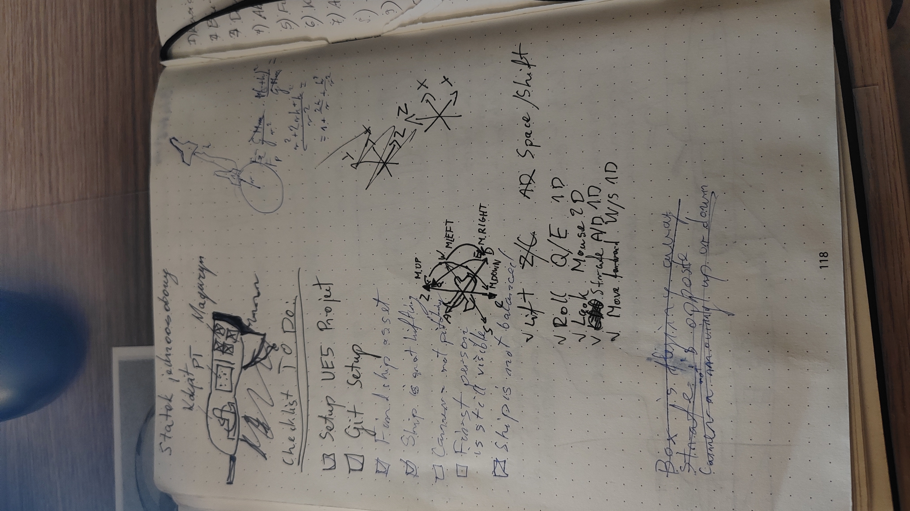

# Garbage Galaxy
Own project of a FPP game in Unreal Engine 5.5. A mix of Sea of Thieves, No man's sky and few others.

## Functionalities

### MoSCoW analysis
Moscow analysis of features is based on impact and urgency of each point. Its distance from the point 0 determines importance of the feature.

## Old GDD notes

